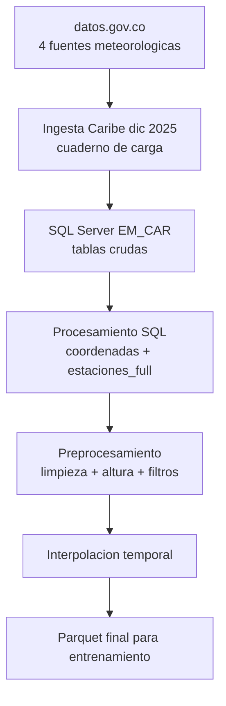

# Borrador Técnico de Insumo para Maestría

## Identificación del documento
- Título: Pipeline de datos meteorológicos Caribe (diciembre 2025) para generación de insumos de entrenamiento
- Fecha de elaboración: 2026-04-24
- Proyecto: PINNs meteorología
- Propósito: servir como insumo estructurado para un agente que elaborará texto académico de trabajo de maestría
- Alcance: exclusivamente región Caribe, periodo diciembre de 2025

## Instrucciones de uso para agente consumidor
1. Tratar este documento como fuente de contexto técnico y metodológico, no como texto final de tesis.
2. Mantener intacta la cadena de trazabilidad de datos (fuente -> transformación -> salida).
3. Cuando se use una afirmación técnica en redacción académica, asociarla a un placeholder bibliográfico de la sección Referencias sugeridas.
4. No extrapolar resultados fuera de Caribe dic-2025 sin evidencia adicional.

## 1. Resumen técnico ejecutivo
El pipeline convierte datos meteorológicos abiertos de datos.gov.co en datasets parquet listos para entrenamiento de modelos PINN. El proceso inicia con la descarga por API de cuatro variables (presión, dirección del viento, velocidad del viento, temperatura del aire), continúa con integración y depuración en SQL Server y finaliza con preprocesamiento temporal-físico e interpolación para producir salidas de entrenamiento.

Salidas principales del pipeline:
- `data/raw/em_caribe_251201_251231.parquet`

## 2. Objetivo del pipeline analizado
Construir un dataset consistente para modelamiento PINN a partir de observaciones meteorológicas heterogéneas, garantizando:
- coherencia temporal por estación,
- coherencia espacial (coordenadas depuradas y altura),
- consistencia físico-estadística mínima mediante filtros e interpolación.

## 3. Alcance y delimitaciones
Incluye:
- descarga en `cuadernos/carga_db_cundinamarca.ipynb` para Caribe dic-2025,
- procesamiento en scripts SQL de `scripts_sql/`,
- preprocesamiento y exportación en `cuadernos/preprocesamiento.ipynb`.

No incluye:
- validación de desempeño del modelo PINN,
- comparación con otros periodos/regiones,
- análisis de sensibilidad de hiperparámetros de entrenamiento.

## 4. Metodología del pipeline (síntesis por etapas)

### 4.1 Etapa de adquisición de datos
En el cuaderno de carga se ejecuta una ingesta paginada por API para Caribe dic-2025:
- ventana temporal: `2025-12-01T00:00:00` a `2025-12-31T23:59:59`,
- departamentos: Atlántico, Bolívar, Magdalena, Sucre y Córdoba,
- endpoints: presión (`62tk-nxj5`), dirección (`kiw7-v9ta`), velocidad (`sgfv-3yp8`), temperatura (`sbwg-7ju4`).

Cada bloque descargado se tipifica y se inserta por lotes en SQL Server (`EM_CAR`) con confirmación por página.

### 4.2 Etapa de estructuración SQL
El procesamiento SQL organiza y consolida datos en cinco operaciones:
1. creación de base (`creacion_base_de_datos.sql`),
2. DDL de tablas crudas y derivadas (`ddl_BD.sql`),
3. normalización de coordenadas con redondeo a tres decimales (`redondeo_lon_lat.sql`),
4. consolidación de coordenadas por estación (`coordenada_estaciones.sql`),
5. integración multi-variable por estación-fecha (`estaciones_full.sql`).

Resultado central SQL: `dbo.estaciones_full` + `dbo.coordenadas_estaciones`.

### 4.3 Etapa de preprocesamiento y generación de insumos
En `cuadernos/preprocesamiento.ipynb` se ejecuta:
1. carga de tablas consolidadas,
2. remoción de identificadores técnicos y agregación por estación-fecha,
3. selección de estaciones con cobertura suficiente,
4. incorporación de coordenadas y elevación (Open-Elevation),
5. eliminación de duplicados,
6. transformación de tiempo a segundos,
7. descomposición de viento en componentes `vel_u` y `vel_v`,
8. filtros físicos (`presion > 800`, `altura < 1000`),
9. interpolación cúbica en intervalo de 20 min,
10. exportación parquet.

## 5. Matriz de trazabilidad (obligatoria)

| Etapa | Fuente de entrada | Transformación principal | Salida intermedia/final | Uso posterior |
|---|---|---|---|---|
| Adquisición | API datos.gov.co (4 endpoints) | Consulta SoQL con filtros espacio-temporales + paginación | Bloques CSV tipificados | Ingesta SQL por lotes |
| Ingesta SQL | Bloques tabulares por variable | Inserción `executemany` en tablas crudas | `dbo.presion`, `dbo.dir_viento`, `dbo.vel_viento`, `dbo.temp_aire` | Base para consolidación |
| Normalización espacial | Tablas crudas | Redondeo lat/lon a 3 decimales | Coordenadas estandarizadas | Reduce dispersión de coordenadas |
| Consolidación de estaciones | Tablas crudas normalizadas | Unión de coordenadas y consolidación por estación | `dbo.coordenadas_estaciones` | Mapeo espacial en preproceso |
| Integración analítica | 4 tablas crudas | Join por `codigo_estacion` + `fecha_observacion` | `dbo.estaciones_full` | Tabla principal de señales |
| Limpieza/selección | `estaciones_full` + `coordenadas_estaciones` | Agregación, filtrado de cobertura, deduplicación | `wsdata` limpio | Base de ingeniería de variables |
| Enriquecimiento físico | `wsdata` + API elevación | Adición de `altura`, `segundos`, `vel_u`, `vel_v` | Dataset físico consistente | Filtros e interpolación |
| Filtrado e interpolación | Dataset físico consistente | Filtros de calidad + interpolación cúbica temporal | `*_22ws.parquet`, `*_22ws_interpo.parquet` | Insumo de entrenamiento PINN |

## 6. Hallazgos técnicos relevantes
1. El pipeline depende de integración multi-variable por estación-fecha; registros incompletos no pasan a la tabla analítica final.
2. La calidad espacial mejora con redondeo y consolidación de coordenadas, pero puede introducir pequeñas pérdidas de precisión geográfica.
3. La elevación se obtiene de un servicio externo, por lo que existe dependencia operativa adicional.
4. La interpolación a 20 min homogeniza malla temporal para entrenamiento, a costa de introducir supuestos suaves entre observaciones.

## 7. Riesgos metodológicos para redacción de tesis
- Riesgo de disponibilidad de fuentes externas (API pública y API de elevación).
- Riesgo de sesgo por selección de estaciones (criterio de cobertura temporal).
- Riesgo de sobreconfianza en datos interpolados sin evaluación de error de interpolación.
- Riesgo de reproducibilidad si no se congelan versiones de scripts/parámetros por corrida.

## 8. Recomendaciones para siguiente documento académico
1. Incluir una subsección formal de validez interna del dato preprocesado (completitud, consistencia, plausibilidad física).
2. Definir explícitamente el dataset oficial de entrenamiento entre los tres parquet generados.
3. Añadir tabla de metadatos por corrida: fecha, filtros, número de estaciones, número de registros por etapa.
4. Incorporar un protocolo de contingencia cuando falle Open-Elevation (cache local o reintentos controlados).

## 9. Referencias sugeridas (placeholders para completar)
- [REF-01] Documentación oficial de Socrata SoQL y API de datos.gov.co.
- [REF-02] Documentación técnica de SQL Server para operaciones de carga por lotes y joins analíticos.
- [REF-03] Referencia metodológica sobre control de calidad de datos meteorológicos.
- [REF-04] Referencia sobre interpolación cúbica en series temporales ambientales.
- [REF-05] Referencia sobre preparación de datos para modelos PINN.

---

## Anexo A. Diagrama ejecutivo del pipeline (Mermaid)

## Anexo B. Artefactos disponibles
- Informe: `informes/pipeline_caribe_dic2025_informe_ejecutivo.md`
- Diagrama fuente Mermaid: `informes/pipeline_caribe_dic2025.mmd`
- Diagrama SVG: `informes/pipeline_caribe_dic2025.svg`
- Diagrama PNG: `informes/pipeline_caribe_dic2025.png`
